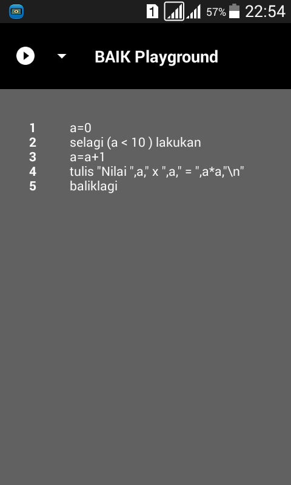
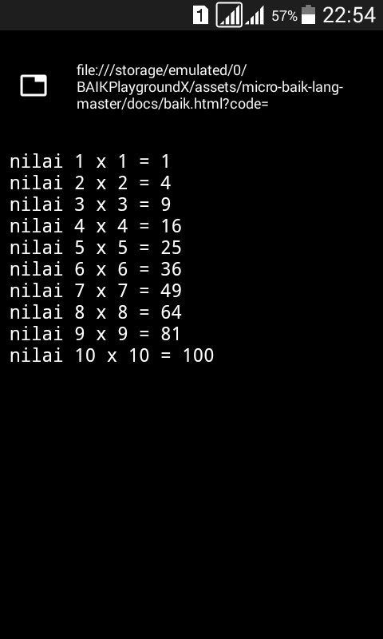

# BAIKPlayground

Gambar Text Editor

Gambar Browser

#Tutorial Install
#### 1.Silakan anda download file micro-baik-lang-master terlebih dahulu.
https://github.com/anak10thn/micro-baik-lang.git
#### 2.Langkah ke 2, Silakan install aplikasi BAIKPlayground APK.
#### 3.Langkah ke 3, Silakan buka aplikasinya.
#### 4.Lalu silakan atur path di sebelah menu Play klik dropdown menu.
#### 5.Lalu akses file baik.html, silakan cari jika ada silakan akses pathnya dan taro nama pathnya di menu yang disediakan.
Contoh :  file:///storage/0/emulated/sdcard/BAIKPlaygroundX/assets/micro-baik-lang-master/docs/baik.html?code=
#### 6.oke jika sudah berhasil akan seperti gambar1 dan gambar2 yang ada diatas. selamat belajar.

##### Woa-Labs
